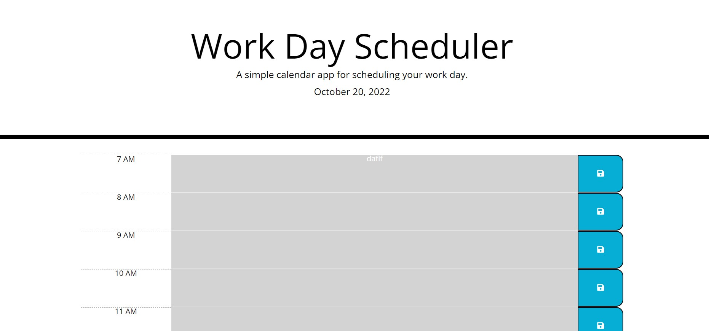

# work-day-planner

1. Cloned starter code, created folder structure and pushed into the repo URL-  https://github.com/ashwinilh/work-day-planner
2. Hosted the repo "work-day-planner" on github live website with the URL-  https://ashwinilh.github.io/work-day-planner/
3. This repo is for challenge 5 of UT boot camp to create  a simple calendar application that allows a user to save events for each hour of the day.
4. Added functionality to load current date on the top of the page
5. Added time blocks in html file
6. functionality to add tasks dynamically and save button selected on click.
7. code for saving tasks in local storage, loading from local storage .
8. code for editing tasks and storing
9. Added color coding functionality set to run every hour
10. Included README file